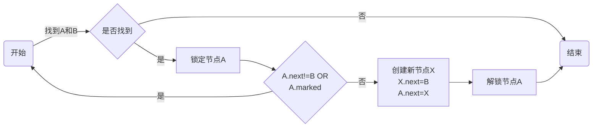
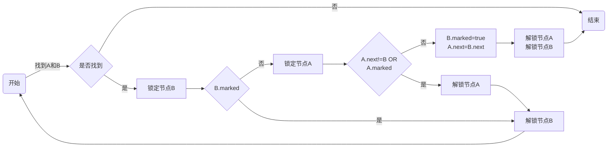
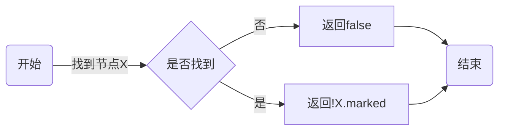

# Golang 并发数据结构和算法实践 大作业

## 飞书学习笔记及踩坑见 https://bytedance.feishu.cn/docs/doccnAI0vIJp423RrXuRfESxgsh#HeOikt

## 背景
本仓库是 @zhangyunhao116 同学关于Golang 并发数据结构和算法实践课程中大作业的实现，目的是使用Golang实现一个并发安全的有序链表，其中数据严格有序并且没有重复元素。

需要完成的工作有：
- 完成插入、查询功能
- 完成删除、遍历功能
- 通过测试，并且不发生data race

## 接口
参照[单线程的有序链表实现](https://gist.github.com/zhangyunhao116/833c3113db343a660a2adb1e4c21951d)，本系统需要提供的接口有

```go
// 1. 创建有序链表
// 返回一个全新的有序链表
NewInt() *IntList

// 2. 有序链表接口
// 检查一个元素是否存在，如果存在则返回 true，否则返回 false
Contains(value int) bool

// 插入一个元素，如果此操作成功插入一个元素，则返回 true，否则返回 false
Insert(value int) bool

// 删除一个元素，如果此操作成功删除一个元素，则返回 true，否则返回 false
Delete(value int) bool

// 遍历此有序链表的所有元素，如果 f 返回 false，则停止遍历
Range(f func(value int) bool)

// 返回有序链表的元素个数
Len() int
```

## 测试
通过[链接](https://gist.github.com/zhangyunhao116/dd9f6f2f984997db18943e0e8738d257)测试
- 通过 go test (< 1s)
- 通过 go test -race (~ 70s)

## 流程图

### 插入
[](https://mermaid-js.github.io/mermaid-live-editor/edit##eyJjb2RlIjoiZ3JhcGggTFJcbkEo5byA5aeLKSAtLT585om-5YiwQeWSjEJ8IEJ75piv5ZCm5om-5YiwfVxuQiAtLT4gfOWQpnwgQyjnu5PmnZ8pXG5CIC0tPiB85pivfCBEW-mUgeWumuiKgueCuUFdXG5EIC0tPiBFe0EubmV4dCE9QiBPUiA8YnI-IEEubWFya2VkfVxuRSAtLT4gfOaYr3wgQVxuRSAtLT4gfOWQpnwgRlvliJvlu7rmlrDoioLngrlYPGJyPlgubmV4dD1CPGJyPkEubmV4dD1YXVxuRiAtLT4gR1vop6PplIHoioLngrlBXVxuRyAtLT4gSCjnu5PmnZ8pXG4iLCJtZXJtYWlkIjoie1xuICBcInRoZW1lXCI6IFwiZGVmYXVsdFwiXG59IiwidXBkYXRlRWRpdG9yIjpmYWxzZSwiYXV0b1N5bmMiOnRydWUsInVwZGF0ZURpYWdyYW0iOmZhbHNlfQ)

### 删除
[](https://mermaid-js.github.io/mermaid-live-editor/edit##eyJjb2RlIjoiZ3JhcGggTFJcbkEo5byA5aeLKSAtLT585om-5YiwQeWSjEJ8IEJ75piv5ZCm5om-5YiwfVxuQiAtLT4gfOWQpnwgQyjnu5PmnZ8pXG5CIC0tPiB85pivfCBEW-mUgeWumuiKgueCuUJdXG5EIC0tPiBFe0IubWFya2VkfVxuRSAtLT4gfOWQpnwgR1vplIHlrproioLngrlBXVxuRSAtLT4gfOaYr3wgRlvop6PplIHoioLngrlCXVxuRiAtLT4gQVxuRyAtLT4gSHtBLm5leHQhPUIgT1I8YnI-IEEubWFya2VkfVxuSCAtLT4gfOWQpnwgSltCLm1hcmtlZD10cnVlPGJyPkEubmV4dD1CLm5leHRdXG5IIC0tPiB85pivfCBJW-ino-mUgeiKgueCuUFdXG5JIC0tPiBGXG5KIC0tPiBLW-ino-mUgeiKgueCuUEgPGJyPiDop6PplIHoioLngrlCXVxuSyAtLT4gQ1xuIiwibWVybWFpZCI6IntcbiAgXCJ0aGVtZVwiOiBcImRlZmF1bHRcIlxufSIsInVwZGF0ZUVkaXRvciI6ZmFsc2UsImF1dG9TeW5jIjp0cnVlLCJ1cGRhdGVEaWFncmFtIjpmYWxzZX0)

### 包含
[](https://mermaid-js.github.io/mermaid-live-editor/edit/##eyJjb2RlIjoiZ3JhcGggTFJcbkEo5byA5aeLKSAtLT585om-5Yiw6IqC54K5WHwgQnvmmK_lkKbmib7liLB9XG5CIC0tPiB85ZCmfCBDW-i_lOWbnmZhbHNlXVxuQyAtLT4gRCjnu5PmnZ8pXG5CIC0tPiB85pivfCBFW-i_lOWbniFYLm1hcmtlZF1cbkUgLS0-IEYiLCJtZXJtYWlkIjoie1xuICBcInRoZW1lXCI6IFwiZGVmYXVsdFwiXG59IiwidXBkYXRlRWRpdG9yIjpmYWxzZSwiYXV0b1N5bmMiOnRydWUsInVwZGF0ZURpYWdyYW0iOmZhbHNlfQ)

### mermaid 源代码



